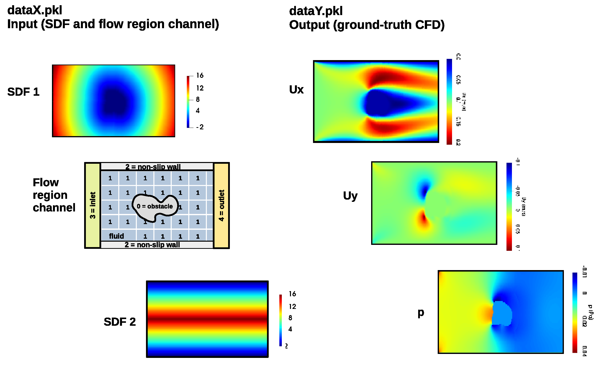
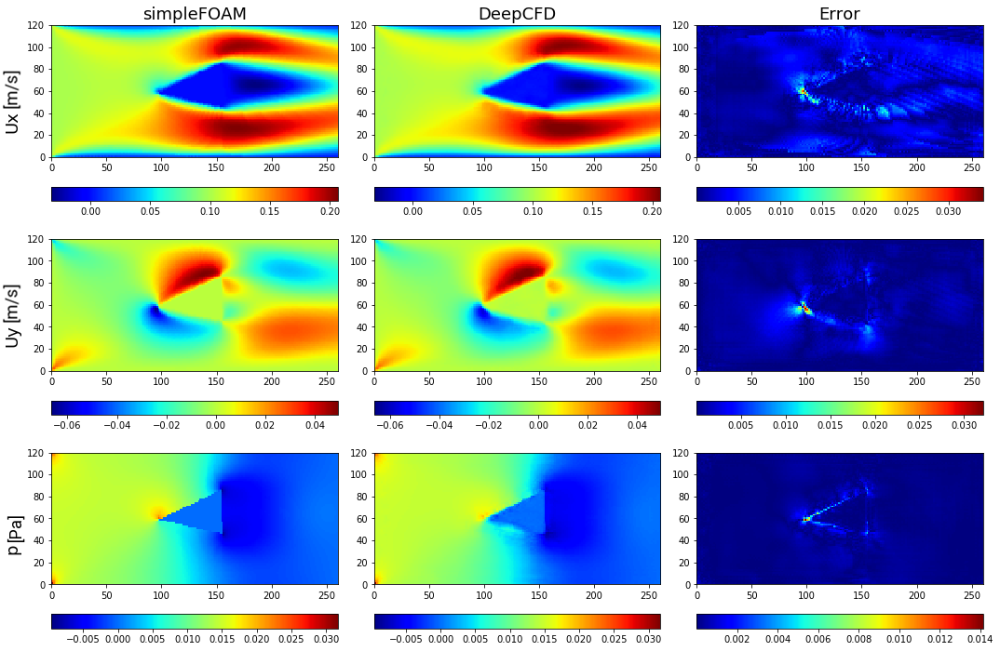

# Rotation-Equivariant DeepCFD
Ribeiro, Rehman et al. propose in their paper "DeepCFD: Efficient Steady-State Laminar Flow Approximation with Deep Convolutional NeuralNetworks" a U-Net-shaped convolutional 
neural network, which efficiently approximates solutions to computationally intensive Computational Fluid Dynamics (CFD) simulations. 
Their model is able to learn complete solutions of the Navier-Stokes equations for velocity and pressure. 

Paper: https://arxiv.org/pdf/2004.08826.pdf

This project shows, that the error between deep-learning based approximation of a CFD simulation and the corresponding real CFD simulation can be significantly reduced by using General E(2)-Equivariant Steerable CNNs.
The e2cnn-Pytorch extension created by Weiler and Cesa is used for this purpose.

Paper: https://arxiv.org/pdf/1911.08251.pdf

## DeepCFD dataset and their results
The toy dataset and the code for the DeepCFD project can be downloaded using the following link: https://zenodo.org/record/3666056/files/DeepCFD.zip?download=1

The dataset contains 981 channel flow samples. The dataY.pkl file contains the ground-truth CFD solution for the velocity and pressure fields. 
The dataX.pkl file contains the three input channels. 


> Figure 1. DeepCFD toy dataset structure.

Ribeiro, Rehman et al. used a U-Net-shaped carried out several experiments and found empirically that a network with one encoder and three decoders worked best.


> Figure 2. DeepCFD U-Net Architecture.

Their proposed network architecture achieved a Mean-Squared-Error of 2.03 for a defined dataset-split, on which all expirements were carried out.


> Figure 3. Comparison between ground-truth CFD (simpleFOAM) and DeepCFD prediction, showing both velocity components, and pressure fields, as well as absolute error in flow.

## Improvement by E(2)-Equivariant Steerable CNNs
To show improvement by using E(2)-Equivariant Steerable CNNs, I decided to take the DeepCFD architecture and make it rotationally equivariant. Different experiments were carried out, in which hyperparameters
and changes in the architecture were examined. Instead of using padded convolutions like it was in the DeepCFD architecture, using non-padded Convolutions yields better results. Extensive padding was done
on the input to maintain the same output size as the input example. This is necessary since the upper and lower wall have non-slip characteristics and need to be displayed.
The rotationally-equivariant network was trained 
for 500 epochs with a learning rate of 0.001 and a decay at the 200th epoch to 0.0001.

In the end the proposed network had a Mean-Squared-Error of 1.81 on the test data which is an improvement of ca. 10%. 

Furthermore I found out, that there are 8 samples in the dataset
which contribute a unusual large portion to the error. In fact, these samples are quite different to the average samples in the dataset. They are either flawed or from a different distribution. 

The notebook "visualization_of_results.ipynb" visualizes some example results and some erroneous samples as well.

## Status
The problems with the dataset invalidate the results of the DeepCFD-paper to a certain extent. Therefore I decided to stop working on the project.

## To-do-list
After contacting the creators of the DeepCFD-paper, they answered, they are planning on developing a better and more diverse dataset. One could keep an eye on their project, if the interest is there.

Furthermore, the Thuerey Group at TU Munich are researching in a similar field and also tried to approximate CFD flows around airfols with deep learning based approaches 
in their paper "Deep Learning Methods for Reynolds-Averaged Navier-Stokes Simulations ofAirfoil Flows". Since it is a similar experiment, one could evaluate if it is worth to 
examine the performance of E(2)-Equivariant Steerable CNNS there.

Paper: https://arxiv.org/pdf/1810.08217.pdf

## Setup
To run this project, the e2cnn-Pytorch extension needs to be downloaded and installed from their github (https://github.com/QUVA-Lab/e2cnn). 

The requirements.txt file contains all libraries and respective versions which are needed to run the script.

Furthermore, the CFD data needs to be downloaded from https://zenodo.org/record/3666056/files/DeepCFD.zip?download=1. Paste the dataX.pkl and dataY.pkl into the folder of the script.

## Code Examples
To run the script:
```
python equivariant_DeepCFD.py
```

## Citation

The Pytorch extension which is used was created by:
```
@inproceedings{e2cnn,
    title={{General E(2)-Equivariant Steerable CNNs}},
    author={Weiler, Maurice and Cesa, Gabriele},
    booktitle={Conference on Neural Information Processing Systems (NeurIPS)},
    year={2019},
}
```

## Contact
Created by [@Alexander Bös](mailto:alex.boes@tum.de).
